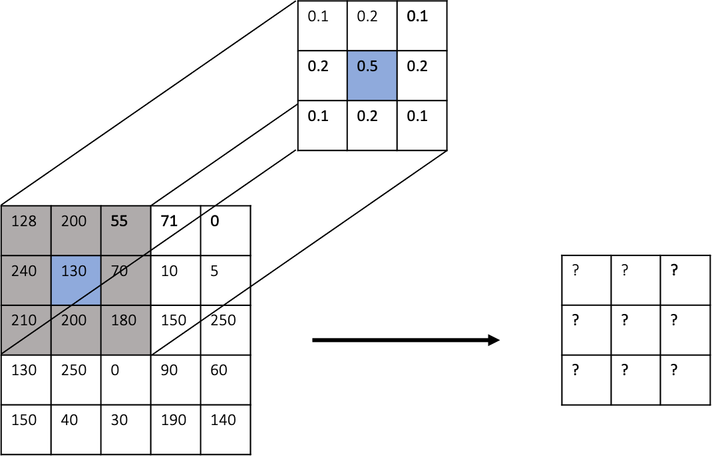

# Übungsblatt #12

## Aufgabe 1

Die beiden Bilder "aerial1.tif" und "aerial2.tif" haben leider eine Qualität, die für eine weitere Verarbeitung der Bilder nicht ausreichend ist.
Sie sollen daher mit geeigneten Methoden aus der Vorlesung die beiden Bilder "verbessern".

a) Laden Sie die beiden Bilder "aerial1.tif" und "aerial2.tif"

b) Betrachten Sie für beide Bilder die Histogramme der Pixelintensitäten.

c) Nutzen Sie geeignete Methoden, um die Bilder kontrastreicher darzustellen. *Machen Sie sich mit ``cv2``  vertraut und 
schauen Sie, ob es die gewünschten Transformationen bereits als Funnktionen in ``cv2``  gibt.*

## Aufgabe 2

In dieser Aufgabe sollen Sie sich mit dem Konzept des lokalen adaptiven Schwellenwerts beschäftigen.

a) Laden Sie das Bild "sonnet.jpg"

b) Warum ist das binärisierte Bild, welches wir durch Otsus Methode erhalten, in diesem Fall nicht gut?

c) Nutzen Sie das Konzept des "lokalen adaptiven Schwellenwerts", um das ursprüngliche Bild zu binärisieren.
Nutzen Sie für die Berechnung (1) den Mittelwert und (2) den Median. Für den Mittelwert können Sie die Funktion 
``cv2.adaptiveThreshold`` mit dem Argument ``cv2.ADAPTIVE_THRESH_MEAN_C`` nutzen ([Dokumentation](https://docs.opencv.org/4.x/d7/d4d/tutorial_py_thresholding.html)). 
Für den Median müssen Sie eine eigene Funktion schreiben.

d) Produziert der Median in diesem Fall ein besseres oder schlechteres Resultat? Nennnen Sie Vermutungen, wieso dies der Fall ist.

## Aufgabe 3

Betrachten Sie die folgende Abbildung und berechnen Sie die Ergebnismatrix der Faltung. **Hinweis: Dieses Beispiel dient nur der Veranschaulichung
des Konzepts der Faltung. Die Werte in der Ergebnismatrix können in diesem Fall größer als 255 sein.**

